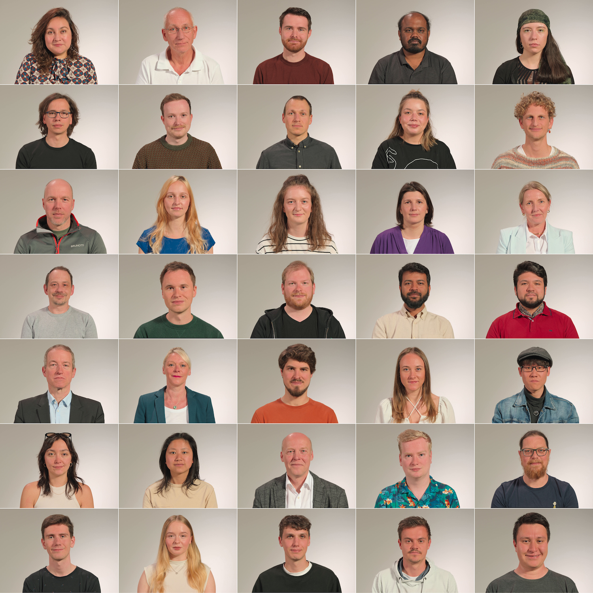

# AVT-VQDB-Faces
An 4K HDR dataset published by the AVT group of TU Ilmenau.

This is a repository with data related to the 4K HDR faces dataset that has not yet been published.
However, to download the videos it is recommended to use the provided link, because the videos are not hosted in this repository.
This work is part of the Interconnected Lab for MEdia Technology Analytics (ILMETA), funded by Deutsche Forschungsgemeinschaft (DFG, No. 438822823) and it is conducted in the framework of PoQuMo8K, a ZIM project (No. KK5112706ER1).

If you use any of the data or code please cite the following paper:

```bibtex
@article{keller2025asubjective,
  title={A Subjective and Objective Evaluation of Viewing Distance and 4K Video Quality},
  author={Keller, Dominik and Ramachandra Rao, Rakesh Rao and Prenzel, Julius and Raake, Alexander},
  journal={to appear},
  year={2025},
  publisher={to appear}
}
```


## Dataset

The dataset consists of 4 different lighting scenarios and a loop through those 4 lighting scenarios. 
Each scenario has 35 subjects. In the thumbnail we show lighting scenario 1.


*Thumbnails of 35 out of 175 sources (converted to Rec 709 for viewing purposes)*

Below a proxy of the loop can be seen.

[](https://www.youtube.com/watch?v=_U5avwk3Ak0)


## Download
Download the sources: https://forms.gle/8VqFPzdUGyEcf3jV9

Find the objective metric data in this git.

## Checksums   

SHA-512 checksums will be found [here](https://avtshare01.rz.tu-ilmenau.de/avt-vqdb-faces/checksums.sha512).
MD5 checksums can be found [here](https://avtshare01.rz.tu-ilmenau.de/avt-vqdb-faces/checksums.md5).


## License
This database consists of short term videos that are created from scratch by TU Ilmenau. The tools provided in this repository can be used to download the shared videos that are used in the described video quality tests.
Our own contents follow the [Attribution-NonCommercial 4.0 International (CC BY-NC 4.0)](https://creativecommons.org/licenses/by-nc/4.0/) licence.

